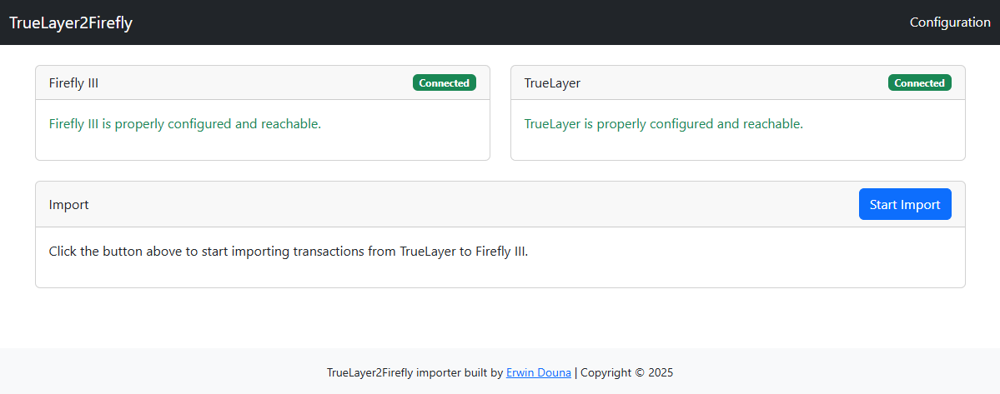

<!-- PROJECT SHIELDS -->
[![GitHub Release][releases-shield]][releases]
![Project Stage][project-stage-shield]
![Project Maintenance][maintenance-shield]
[![License][license-shield]](LICENSE)

[![GitHub Activity][commits-shield]][commits-url]
[![GitHub Last Commit][last-commit-shield]][commits-url]
[![Open in Dev Containers][devcontainer-shield]][devcontainer]

[![Build Status][build-shield]][build-url]


Ultrafast and lightweight appliacation to synchornize your TrueLayer transactions to Firefly III

>[!NOTE]
>This project is in an experimental stage. Feelf ree to use it, but be aware that it may not be fully stable or feature-complete. Your feedback and contributions are welcome as we work towards a more polished release. Raise an [issue](https://github.com/erwindounaner/truelayer2firefly/issues) if you run into any problems or have suggestions for improvements. Thank you for your understanding and support!


This is an asynchronous Python application for to synchronize your transactions to [Firefly III](https://firefly-iii.org/), via the [TrueLayer](https://www.truelayer.com/) financial services platform.
It offers a user-friendly interface for managing the process and configuration. It's design is to be minimal and efficient.



## Installation

You can install the application via Docker Compose or via the Docker command:

### Docker compose
```dockerfile
services:
  truelayer2firefly:
    iimage: erwind/truelayer2firefly:latest
    container_name: truelayer2firefly
    ports:
      - "3000:3000" # Update this to your desired port
    volumes:
      - /YOUR_MOUNT:/app/data # Update this to your mount point
```

### Docker command
```dockerfile
docker run -d \
  --name truelayer2firefly \
  -p 3000:3000 \
  -v /YOUR_MOUNT:/app/data \
  erwind/truelayer2firefly:latest
```

## Configuration
The application will create a basic configuration file to store your settings.

### Firefly III
Follow these steps to set up your Firefly III instance:
1. Create an OAuth Client in your Firefly III instance. You can do this by going to
`Profile > OAuth > OAuth Clients` and clicking on `Create OAuth Client`. Make sure to **uncheck** the `Confidential` option.
2. Fill in the `Name` and `Redirect URI` fields. The `Redirect URL` should be set to `http://{YOUR_HOST}:{YOUR_PORT}/auth/firefly/callback`. For example, if you are running the application on `localhost` and port `3000`, the redirect URL would be `http://localhost:3000/auth/firefly/callback`. This needs to **100%** match the URL you are using to access the application.
3. In TrueLayer2Firefly, fill in the `API URL` with the URL of your Firefly III instance. For example, if you are running Firefly III on `localhost` and port `8080`, the API URL would be `http://localhost:8080`. Also fill in the `Client ID`. You will now be guided through the OAuth flow to authorize the application to access your Firefly III instance.
4. On completion, you will be redirected to the application and your Firefly III instance will be connected.

### TrueLayer
Follow these steps to set up your TrueLayer instance. This is a bit more complicated, so follow these steps carefully. You can find more information on the [TrueLayer documentation](https://docs.truelayer.com/).
1. Create an application in the [TrueLayer dashboard](https://console.truelayer.com/) (sign up if you don't have an account yet).
2. Switch your application to `Live` mode. This is done by clicking on the `Switch to Live` button in the top right corner of the dashboard. You can confirm if you're in `Live` mode by checking the the `Client ID`. This should **not** start with `sandbox-`.
2. Find your `Client ID` and `Client Secret` in the application settings. These can be found in the `Settings` tab of your application. If you forgot somehow your `Client Secret`, you can regenerate it in the `Settings` tab.
3. In the `Redirect URI` field, fill in the URL of your TrueLayer2Firefly instance. For example, if you are running the application on `localhost` and port `3000`, the redirect URL would be `http://localhost:3000/auth/truelayer/callback`. This needs to **100%** match the URL you are using to access the application.
4. In TrueLayer2Firefly, fill in the `Client ID`,`Client Secret`, `Redirect URI` with the values from the TrueLayer dashboard. Again, this needs to **100%** match the URL you are using to access the application. You will now be guided through the OAuth flow to authorize the application to access your TrueLayer instance. You can filter per country and then find the banking institutions you want to connect to.
5. From here, follow the instructions in the application to connect your bank accounts.
6. On completion, you will be redirected to the application and your bank accounts will be connected. You can now start synchronizing your transactions!

## Contributing

This is an active open-source project. We are always open to people who want to
use the code or contribute to it.

We've set up a separate document for our
[contribution guidelines](CONTRIBUTING.md).

Thank you for being involved! :heart_eyes:

## Setting up development environment

The simplest way to begin is by utilizing the [Dev Container][devcontainer]
feature of Visual Studio Code or by opening a CodeSpace directly on GitHub.
By clicking the button below you immediately start a Dev Container in Visual Studio Code.

[![Open in Dev Containers][devcontainer-shield]][devcontainer]

This Python project relies on [Poetry][poetry] as its dependency manager,
providing comprehensive management and control over project dependencies.

You need at least:

- Python 3.11+
- [Poetry][poetry-install]

### Installation

Install all packages, including all development requirements:

```bash
poetry install
```

_Poetry creates by default an virtual environment where it installs all
necessary pip packages_.

### Pre-commit

This repository uses the [pre-commit][pre-commit] framework, all changes
are linted and tested with each commit. To setup the pre-commit check, run:

```bash
poetry run pre-commit install
```

And to run all checks and tests manually, use the following command:

```bash
poetry run pre-commit run --all-files
```

### Testing

It uses [pytest](https://docs.pytest.org/en/stable/) as the test framework. To run the tests:

```bash
poetry run pytest
```

To update the [syrupy](https://github.com/tophat/syrupy) snapshot tests:

```bash
poetry run pytest --snapshot-update
```

## License

MIT License

Copyright (c) 2025 Erwin Douna

Permission is hereby granted, free of charge, to any person obtaining a copy
of this software and associated documentation files (the "Software"), to deal
in the Software without restriction, including without limitation the rights
to use, copy, modify, merge, publish, distribute, sublicense, and/or sell
copies of the Software, and to permit persons to whom the Software is
furnished to do so, subject to the following conditions:

The above copyright notice and this permission notice shall be included in all
copies or substantial portions of the Software.

THE SOFTWARE IS PROVIDED "AS IS", WITHOUT WARRANTY OF ANY KIND, EXPRESS OR
IMPLIED, INCLUDING BUT NOT LIMITED TO THE WARRANTIES OF MERCHANTABILITY,
FITNESS FOR A PARTICULAR PURPOSE AND NONINFRINGEMENT. IN NO EVENT SHALL THE
AUTHORS OR COPYRIGHT HOLDERS BE LIABLE FOR ANY CLAIM, DAMAGES OR OTHER
LIABILITY, WHETHER IN AN ACTION OF CONTRACT, TORT OR OTHERWISE, ARISING FROM,
OUT OF OR IN CONNECTION WITH THE SOFTWARE OR THE USE OR OTHER DEALINGS IN THE
SOFTWARE.


<!-- LINKS FROM PLATFORM -->


<!-- MARKDOWN LINKS & IMAGES -->
[build-shield]: https://github.com/erwindouna/truelayer2firefly/actions/workflows/docker-publish.yml/badge.svg
[build-url]: https://github.com/erwindouna/truelayer2firefly/actions/workflows/docker-publish.yml
[codecov-shield]: https://codecov.io/gh/erwindouna/truelayer2firefly/branch/main/graph/badge.svg?token=TOKEN
[codecov-url]: https://codecov.io/gh/erwindouna/truelayer2firefly
[commits-shield]: https://img.shields.io/github/commit-activity/y/erwindouna/truelayer2firefly.svg
[commits-url]: https://github.com/erwindouna/truelayer2firefly/commits/main
[devcontainer-shield]: https://img.shields.io/static/v1?label=Dev%20Containers&message=Open&color=blue&logo=visualstudiocode
[devcontainer]: https://vscode.dev/redirect?url=vscode://ms-vscode-remote.remote-containers/cloneInVolume?url=https://github.com/erwindouna/truelayer2firefly
[downloads-shield]: https://img.shields.io/pypi/dm/truelayer2firefly
[downloads-url]: https://pypistats.org/packages/truelayer2firefly
[last-commit-shield]: https://img.shields.io/github/last-commit/erwindouna/truelayer2firefly.svg
[license-shield]: https://img.shields.io/github/license/erwindouna/truelayer2firefly.svg
[maintainability-shield]: https://api.codeclimate.com/v1/badges/TOKEN/maintainability
[maintainability-url]: https://codeclimate.com/github/erwindouna/truelayer2firefly/maintainability
[maintenance-shield]: https://img.shields.io/maintenance/yes/2025.svg
[project-stage-shield]: https://img.shields.io/badge/project%20stage-experimental-yellow.svg
[pypi]: https://pypi.org/project/truelayer2firefly/
[python-versions-shield]: https://img.shields.io/pypi/pyversions/truelayer2firefly
[releases-shield]: https://img.shields.io/github/release/erwindouna/truelayer2firefly.svg
[releases]: https://github.com/erwindouna/truelayer2firefly/releases
[typing-shield]: https://github.com/erwindouna/truelayer2firefly/actions/workflows/typing.yaml/badge.svg
[typing-url]: https://github.com/erwindouna/truelayer2firefly/actions/workflows/typing.yaml

[poetry-install]: https://python-poetry.org/docs/#installation
[poetry]: https://python-poetry.org
[pre-commit]: https://pre-commit.com
